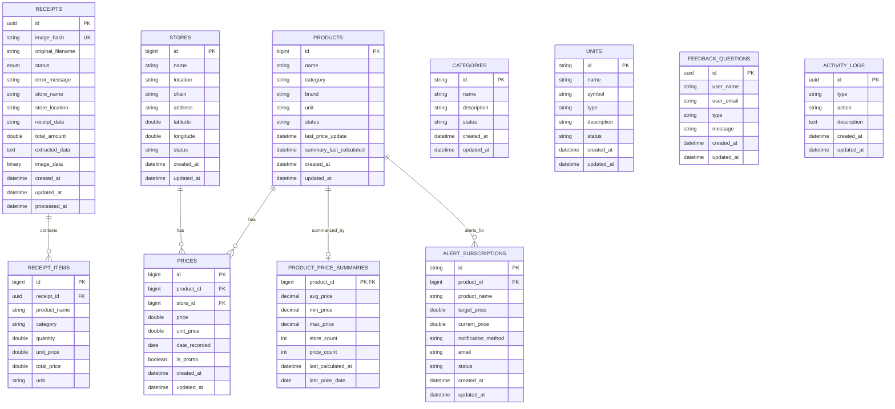

<a id="readme-top"></a>

[![PostgreSQL][postgres-shield]][postgres-url]
[![Flyway][flyway-shield]][flyway-url]

<br />

<div align="center">
  <h3 align="center">Goods Price Comparison Service — Database Schema</h3>
  <p align="center">
    Entity relationship diagram, table definitions, and design decisions.
    <br />
    <a href="ARCHITECTURE_HYBRID.md"><strong>Read the Architecture Docs »</strong></a>
  </p>
</div>

<details>
  <summary>Table of Contents</summary>
  <ol>
    <li><a href="#overview">Overview</a></li>
    <li><a href="#entity-relationship-diagram">Entity Relationship Diagram</a></li>
    <li><a href="#service-ownership">Service Ownership</a></li>
    <li><a href="#table-definitions">Table Definitions</a></li>
    <li><a href="#design-decisions">Design Decisions</a></li>
    <li><a href="#indexes">Indexes</a></li>
    <li><a href="#data-flow">Data Flow</a></li>
    <li><a href="#migration-files">Migration Files</a></li>
  </ol>
</details>

## Overview

The database follows a **schema-per-service** design aligned with the microservice architecture. Each service owns its tables and no service queries another service's tables directly.

<p align="right">(<a href="#readme-top">back to top</a>)</p>

## Entity Relationship Diagram



<p align="right">(<a href="#readme-top">back to top</a>)</p>

## Service Ownership

| Service | Tables | Description |
|---------|--------|-------------|
| **receipt-service** | `receipts`, `receipt_items` | Receipt upload, OCR processing, status tracking |
| **product-service** | `products`, `product_price_summaries`, `categories`, `units` | Product catalog, price summaries, and reference data |
| **store-service** | `stores` | Store directory with locations |
| **price-service** | `prices` | Price records with historical tracking |
| **feedback-service** | `feedback_questions` | User feedback and inquiries |
| **system-service** | `activity_logs` | Audit trail and system activity tracking |
| **alert-service** | `alert_subscriptions` | Price alert subscriptions and notifications |

<p align="right">(<a href="#readme-top">back to top</a>)</p>

## Table Definitions

### receipts

Stores receipt images and processing status.

| Column | Type | Constraints | Description |
|--------|------|-------------|-------------|
| `id` | UUID | PK | Unique identifier |
| `image_hash` | VARCHAR | NOT NULL, UNIQUE | SHA-256 hash for duplicate detection |
| `original_filename` | VARCHAR | | Original uploaded filename |
| `status` | VARCHAR | NOT NULL | PENDING, PROCESSING, COMPLETED, FAILED |
| `error_message` | VARCHAR | | Error details if processing failed |
| `store_name` | VARCHAR | | Extracted store name |
| `store_location` | VARCHAR | | Extracted store location |
| `receipt_date` | VARCHAR | | Date on receipt |
| `total_amount` | DOUBLE | | Total amount from receipt |
| `extracted_data_json` | TEXT | | Raw JSON from LLM extraction |
| `created_at` | TIMESTAMP | | Record creation time |
| `updated_at` | TIMESTAMP | | Last update time |
| `processed_at` | TIMESTAMP | | When processing completed |

### receipt_items

Individual line items extracted from receipts.

| Column | Type | Constraints | Description |
|--------|------|-------------|-------------|
| `id` | BIGINT | PK | Auto-increment identifier |
| `receipt_id` | UUID | NOT NULL, FK | References receipts.id |
| `product_name` | VARCHAR | | Product name as shown on receipt |
| `category` | VARCHAR | | Product category |
| `quantity` | DOUBLE | | Quantity purchased |
| `unit_price` | DOUBLE | | Price per unit |
| `total_price` | DOUBLE | | Total price |
| `unit` | VARCHAR | | Unit of measurement (kg, pcs) |

### products

Product catalog with categorization.

| Column | Type | Constraints | Description |
|--------|------|-------------|-------------|
| `id` | BIGINT | PK | Auto-increment identifier |
| `name` | VARCHAR | NOT NULL | Product name |
| `category` | VARCHAR | | Product category |
| `brand` | VARCHAR | | Product brand |
| `unit` | VARCHAR | | Default unit of measurement |
| `status` | VARCHAR | | ACTIVE, INACTIVE |
| `created_at` | TIMESTAMP | | Record creation time |
| `updated_at` | TIMESTAMP | | Last update time |

### stores

Store directory with location information.

| Column | Type | Constraints | Description |
|--------|------|-------------|-------------|
| `id` | BIGINT | PK | Auto-increment identifier |
| `name` | VARCHAR | NOT NULL | Store name |
| `location` | VARCHAR | | Store location/area |
| `chain` | VARCHAR | | Store chain/brand |
| `address` | VARCHAR | | Full address |
| `latitude` | DOUBLE | | GPS latitude |
| `longitude` | DOUBLE | | GPS longitude |
| `status` | VARCHAR | | ACTIVE, INACTIVE |
| `created_at` | TIMESTAMP | | Record creation time |
| `updated_at` | TIMESTAMP | | Last update time |

### prices

Price records with historical tracking.

| Column | Type | Constraints | Description |
|--------|------|-------------|-------------|
| `id` | BIGINT | PK | Auto-increment identifier |
| `product_id` | BIGINT | NOT NULL, FK | References products.id |
| `store_id` | BIGINT | NOT NULL, FK | References stores.id |
| `price` | DOUBLE | NOT NULL | Price amount |
| `unit_price` | DOUBLE | | Price per standard unit |
| `date_recorded` | DATE | NOT NULL | When price was recorded |
| `is_promo` | BOOLEAN | NOT NULL, DEFAULT FALSE | Promotional price flag |
| `created_at` | TIMESTAMP | | Record creation time |
| `updated_at` | TIMESTAMP | | Last update time |

<p align="right">(<a href="#readme-top">back to top</a>)</p>

### product_price_summaries

Denormalized price statistics computed from `prices` records. One-to-one with `products`.

| Column | Type | Constraints | Description |
|--------|------|-------------|-------------|
| `product_id` | BIGINT | PK, FK | References products.id |
| `avg_price` | DECIMAL(10,2) | | Average price across stores |
| `min_price` | DECIMAL(10,2) | | Minimum recorded price |
| `max_price` | DECIMAL(10,2) | | Maximum recorded price |
| `store_count` | INT | | Number of distinct stores |
| `price_count` | INT | | Number of price records |
| `last_calculated_at` | TIMESTAMP | NOT NULL | When summary was computed |
| `last_price_date` | DATE | | Date of the most recent price |

### categories

Product category reference data for standardized categorization.

| Column | Type | Constraints | Description |
|--------|------|-------------|-------------|
| `id` | VARCHAR(50) | PK | Category code identifier |
| `name` | VARCHAR(100) | NOT NULL | Display name |
| `description` | TEXT | | Detailed description |
| `status` | VARCHAR(50) | DEFAULT 'ACTIVE' | ACTIVE, INACTIVE |
| `created_at` | TIMESTAMP | | Record creation time |
| `updated_at` | TIMESTAMP | | Last update time |

### units

Measurement unit reference data used across products and receipt items.

| Column | Type | Constraints | Description |
|--------|------|-------------|-------------|
| `id` | VARCHAR(50) | PK | Unit code (kg, pcs, l) |
| `name` | VARCHAR(100) | NOT NULL | Display name |
| `symbol` | VARCHAR(10) | | Short symbol |
| `type` | VARCHAR(20) | NOT NULL | WEIGHT, VOLUME, COUNT, LENGTH |
| `description` | TEXT | | Detailed description |
| `status` | VARCHAR(50) | DEFAULT 'ACTIVE' | ACTIVE, INACTIVE |
| `created_at` | TIMESTAMP | | Record creation time |
| `updated_at` | TIMESTAMP | | Last update time |

### feedback_questions

User-submitted feedback and inquiries.

| Column | Type | Constraints | Description |
|--------|------|-------------|-------------|
| `id` | UUID | PK | Unique identifier |
| `user_name` | VARCHAR(100) | NOT NULL | Submitter name |
| `user_email` | VARCHAR(150) | NOT NULL | Submitter email |
| `type` | VARCHAR(20) | NOT NULL | Feedback type (QUESTION, SUGGESTION, COMPLAINT) |
| `message` | TEXT | NOT NULL | Feedback content |
| `created_at` | TIMESTAMP | | Record creation time |
| `updated_at` | TIMESTAMP | | Last update time |

### activity_logs

Audit trail for system events and user actions.

| Column | Type | Constraints | Description |
|--------|------|-------------|-------------|
| `id` | UUID | PK | Unique identifier |
| `type` | VARCHAR(50) | NOT NULL | Event type (PRICE_CHANGE, USER_ACTION, SYSTEM) |
| `action` | VARCHAR(20) | NOT NULL | Action performed (CREATE, UPDATE, DELETE, READ) |
| `description` | TEXT | | Detailed event description |
| `created_at` | TIMESTAMP | NOT NULL | Record creation time |
| `updated_at` | TIMESTAMP | NOT NULL | Last update time |

### alert_subscriptions

Price alert subscriptions for users monitoring product prices.

| Column | Type | Constraints | Description |
|--------|------|-------------|-------------|
| `id` | VARCHAR(36) | PK | Unique identifier |
| `product_id` | BIGINT | NOT NULL, FK | References products.id |
| `product_name` | VARCHAR(255) | | Denormalized product name |
| `target_price` | DOUBLE | NOT NULL | Target price threshold |
| `current_price` | DOUBLE | | Most recent price snapshot |
| `notification_method` | VARCHAR(50) | | EMAIL, PUSH, SMS |
| `email` | VARCHAR(255) | | Notification email address |
| `status` | VARCHAR(20) | NOT NULL, DEFAULT 'ACTIVE' | ACTIVE, TRIGGERED, CANCELLED |
| `created_at` | TIMESTAMP | NOT NULL | Record creation time |
| `updated_at` | TIMESTAMP | NOT NULL | Last update time |

<p align="right">(<a href="#readme-top">back to top</a>)</p>

## Design Decisions

### No JPA Relationships

Entities do not use JPA relationship annotations (`@ManyToOne`, `@OneToMany`, `@JoinColumn`). Foreign keys are stored as primitive values (`Long storeId`, `UUID receiptId`). This ensures service boundaries are respected and prevents accidental cross-service queries.

### UUID for Receipts

Receipts use UUID identifiers for distributed system support, safe API exposure, and alignment with the external API specification.

### Auto-Increment for Domain Entities

Products, stores, and prices use auto-incrementing BIGINT for smaller index sizes, better locality for range queries, and simpler migration.

### Receipt Status Machine

```
PENDING → PROCESSING → COMPLETED
   ↓         ↓            ↓
FAILED   PENDING_REVIEW  APPROVED
            ↓
         REJECTED
```

<p align="right">(<a href="#readme-top">back to top</a>)</p>

## Indexes

```sql
-- Primary lookups
CREATE INDEX idx_receipts_image_hash ON receipts(image_hash);
CREATE INDEX idx_receipt_items_receipt_id ON receipt_items(receipt_id);
CREATE INDEX idx_prices_product_id ON prices(product_id);
CREATE INDEX idx_prices_store_id ON prices(store_id);
CREATE INDEX idx_prices_date_recorded ON prices(date_recorded);
CREATE INDEX idx_products_name ON products(name);
CREATE INDEX idx_stores_location ON stores(location);

-- V9: Product tracking
CREATE INDEX idx_products_last_price_update ON products(last_price_update);
CREATE INDEX idx_products_summary_last_calc ON products(summary_last_calculated);

-- V15: Missing performance indexes
CREATE INDEX idx_products_category ON products(category);
CREATE INDEX idx_stores_name ON stores(name);
CREATE INDEX idx_receipts_status ON receipts(status);
CREATE INDEX idx_receipts_receipt_date ON receipts(receipt_date);

-- V8: Price summaries
CREATE INDEX idx_price_summaries_product_id ON product_price_summaries(product_id);
CREATE INDEX idx_price_summaries_last_calculated ON product_price_summaries(last_calculated_at);

-- V13: Activity logs
CREATE INDEX idx_activity_logs_type ON activity_logs(type);
CREATE INDEX idx_activity_logs_created_at ON activity_logs(created_at);
```

<p align="right">(<a href="#readme-top">back to top</a>)</p>

## Data Flow

1. **Receipt Upload** — Creates `receipts` record with PENDING status
2. **OCR Processing** — Creates `receipt_items` records; updates `receipts` status
3. **Price Extraction** — Creates `products` (if new) and `prices` records
4. **Price Comparison** — Query `prices` joined with `products` and `stores`
5. **Price Summary** — Scheduled job reads `prices` to compute aggregates into `product_price_summaries`
6. **Category & Unit Management** — CRUD operations on `categories` and `units` reference tables
7. **Feedback Submission** — Creates `feedback_questions` records from user contact forms
8. **Activity Audit** — System events write to `activity_logs` for traceability
9. **Price Alerts** — `alert_subscriptions` monitored against `prices` to detect threshold crossings

<p align="right">(<a href="#readme-top">back to top</a>)</p>

## Migration Files

```
db/migration/
├── tables/          # CREATE TABLE statements
│   ├── V1__create_stores_table.sql
│   ├── V2__create_products_table.sql
│   ├── V3__create_receipts_table.sql
│   ├── V4__create_prices_table.sql
│   ├── V5__create_receipt_items_table.sql
│   ├── V8__create_product_price_summaries_table.sql
│   ├── V10__create_categories_table.sql
│   ├── V11__create_units_table.sql
│   ├── V12__create_feedback_questions_table.sql
│   ├── V13__create_activity_logs_table.sql
│   └── V16__create_alert_subscriptions_table.sql
└── alter/           # ALTER TABLE statements
    ├── V6__add_missing_columns_to_products.sql
    ├── V7__add_missing_columns_to_stores.sql
    ├── V9__add_product_tracking_columns.sql
    ├── V14__add_image_data_column_to_receipts.sql
    └── V15__add_missing_indexes.sql
```

See [README](../README.md) for migration commands.

<p align="right">(<a href="#readme-top">back to top</a>)</p>

---

[postgres-shield]: https://img.shields.io/badge/PostgreSQL-316192?style=for-the-badge&logo=postgresql&logoColor=white
[postgres-url]: https://www.postgresql.org/
[flyway-shield]: https://img.shields.io/badge/Flyway-CC0200?style=for-the-badge&logo=flyway&logoColor=white
[flyway-url]: https://flywaydb.org/
