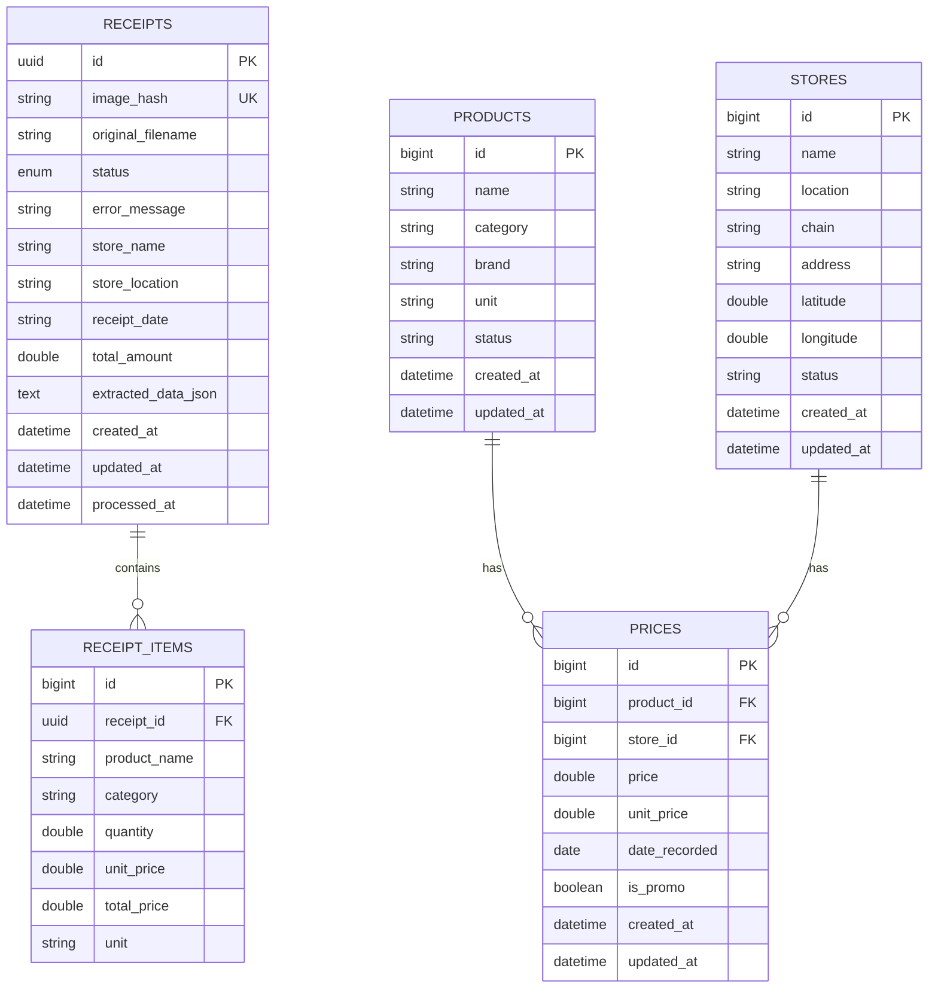

# Entity Relationship Diagram

Visual representation of the database schema and relationships between entities.

## Overview

The database follows a **schema-per-service** design aligned with the microservice architecture. Each service owns its tables and no service queries another service's tables directly.

## Entity Relationship Diagram



## Service Ownership

| Service | Tables | Description |
|---------|--------|-------------|
| **receipt-service** | `receipts`, `receipt_items` | Receipt upload, OCR processing, status tracking |
| **product-service** | `products` | Product catalog and categorization |
| **store-service** | `stores` | Store directory with locations |
| **price-service** | `prices` | Price records with historical tracking |

## Table Definitions

### receipts

Stores receipt images and processing status.

| Column | Type | Constraints | Description |
|--------|------|-------------|-------------|
| `id` | UUID | PK | Unique identifier |
| `image_hash` | VARCHAR | NOT NULL, UNIQUE | SHA-256 hash for duplicate detection |
| `original_filename` | VARCHAR | | Original uploaded filename |
| `status` | VARCHAR | NOT NULL | PENDING, PROCESSING, COMPLETED, FAILED, etc. |
| `error_message` | VARCHAR | | Error details if processing failed |
| `store_name` | VARCHAR | | Extracted store name |
| `store_location` | VARCHAR | | Extracted store location |
| `receipt_date` | VARCHAR | | Date on receipt (as string) |
| `total_amount` | DOUBLE | | Total amount from receipt |
| `extracted_data_json` | TEXT | | Raw JSON from LLM extraction |
| `created_at` | TIMESTAMP | | Record creation time |
| `updated_at` | TIMESTAMP | | Last update time |
| `processed_at` | TIMESTAMP | | When processing completed |

### receipt_items

Individual line items extracted from receipts.

| Column | Type | Constraints | Description |
|--------|------|-------------|-------------|
| `id` | BIGINT | PK | Auto-increment identifier |
| `receipt_id` | UUID | NOT NULL, FK | References receipts.id |
| `product_name` | VARCHAR | | Product name as shown on receipt |
| `category` | VARCHAR | | Product category (optional) |
| `quantity` | DOUBLE | | Quantity purchased |
| `unit_price` | DOUBLE | | Price per unit |
| `total_price` | DOUBLE | | Total price (quantity * unit_price) |
| `unit` | VARCHAR | | Unit of measurement (kg, pcs, etc.) |

### products

Product catalog with categorization.

| Column | Type | Constraints | Description |
|--------|------|-------------|-------------|
| `id` | BIGINT | PK | Auto-increment identifier |
| `name` | VARCHAR | NOT NULL | Product name |
| `category` | VARCHAR | | Product category |
| `brand` | VARCHAR | | Product brand |
| `unit` | VARCHAR | | Default unit of measurement |
| `status` | VARCHAR | | ACTIVE, INACTIVE, etc. |
| `created_at` | TIMESTAMP | | Record creation time |
| `updated_at` | TIMESTAMP | | Last update time |

### stores

Store directory with location information.

| Column | Type | Constraints | Description |
|--------|------|-------------|-------------|
| `id` | BIGINT | PK | Auto-increment identifier |
| `name` | VARCHAR | NOT NULL | Store name |
| `location` | VARCHAR | | Store location/area |
| `chain` | VARCHAR | | Store chain/brand |
| `address` | VARCHAR | | Full address |
| `latitude` | DOUBLE | | GPS latitude |
| `longitude` | DOUBLE | | GPS longitude |
| `status` | VARCHAR | | ACTIVE, INACTIVE, etc. |
| `created_at` | TIMESTAMP | | Record creation time |
| `updated_at` | TIMESTAMP | | Last update time |

### prices

Price records with historical tracking.

| Column | Type | Constraints | Description |
|--------|------|-------------|-------------|
| `id` | BIGINT | PK | Auto-increment identifier |
| `product_id` | BIGINT | NOT NULL, FK | References products.id |
| `store_id` | BIGINT | NOT NULL, FK | References stores.id |
| `price` | DOUBLE | NOT NULL | Price amount |
| `unit_price` | DOUBLE | | Price per standard unit |
| `date_recorded` | DATE | NOT NULL | When price was recorded |
| `is_promo` | BOOLEAN | NOT NULL, DEFAULT FALSE | Whether this is a promotional price |
| `created_at` | TIMESTAMP | | Record creation time |
| `updated_at` | TIMESTAMP | | Last update time |

## Key Design Decisions

### 1. No JPA Relationships

As per project architecture rules, entities do **NOT** use JPA relationship annotations (`@ManyToOne`, `@OneToMany`, `@JoinColumn`). Foreign keys are stored as primitive values (`Long storeId`, `UUID receiptId`). This ensures:
- Service boundaries are respected
- No accidental cross-service queries
- Clear data ownership

### 2. UUID for Receipts

Receipts use UUID identifiers to:
- Support distributed systems (no sequence coordination needed)
- Enable safe exposure in APIs without enumeration attacks
- Match the external API specification

### 3. Auto-Increment for Domain Entities

Products, stores, and prices use auto-incrementing BIGINT for:
- Smaller index sizes
- Better locality for range queries
- Simpler migration and data import

### 4. Receipt Status Enum

Receipts track processing through a state machine:

```
PENDING → PROCESSING → COMPLETED
   ↓         ↓            ↓
FAILED   PENDING_REVIEW  APPROVED
            ↓
         REJECTED
```

## Indexes

Recommended indexes for common queries:

```sql
-- Receipt lookups by hash (duplicate detection)
CREATE INDEX idx_receipts_image_hash ON receipts(image_hash);

-- Receipt items by receipt (fetch all items)
CREATE INDEX idx_receipt_items_receipt_id ON receipt_items(receipt_id);

-- Price lookups by product (price history)
CREATE INDEX idx_prices_product_id ON prices(product_id);

-- Price lookups by store (store's price list)
CREATE INDEX idx_prices_store_id ON prices(store_id);

-- Price lookups by date (trend analysis)
CREATE INDEX idx_prices_date_recorded ON prices(date_recorded);

-- Product search by name
CREATE INDEX idx_products_name ON products(name);

-- Store search by location
CREATE INDEX idx_stores_location ON stores(location);
```

## Data Flow

1. **Receipt Upload**: Creates `receipts` record with PENDING status
2. **OCR Processing**: Creates `receipt_items` records; updates `receipts` status
3. **Price Extraction**: Creates `products` (if new) and `prices` records from receipt items
4. **Price Comparison**: Query `prices` joined with `products` and `stores`

## Migration Files

Database migrations are located in:

```
db/migration/
├── tables/          # CREATE TABLE statements
│   ├── V1__create_receipts_table.sql
│   ├── V2__create_receipt_items_table.sql
│   ├── V3__create_products_table.sql
│   ├── V4__create_stores_table.sql
│   └── V5__create_prices_table.sql
└── alter/           # ALTER TABLE statements
    └── V6+ changes
```

See [Database Migrations](../README.md#%EF%B8%8F-database-migrations) section in README for migration commands.

## Related Documentation

- [Architecture Overview](ARCHITECTURE_HYBRID.md) - Full system architecture
- [README](../README.md) - Project setup and usage
