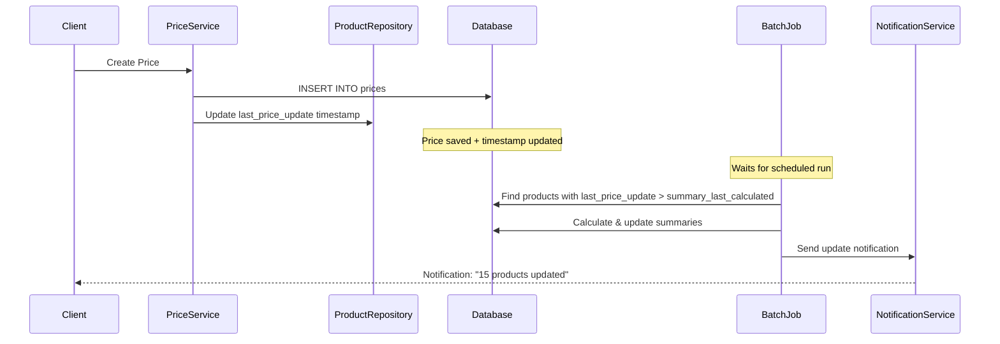
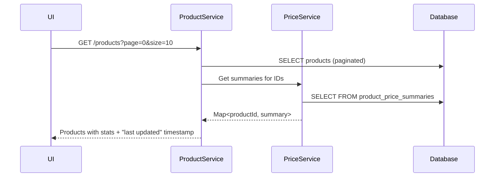
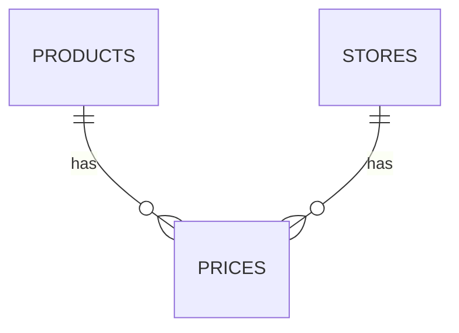
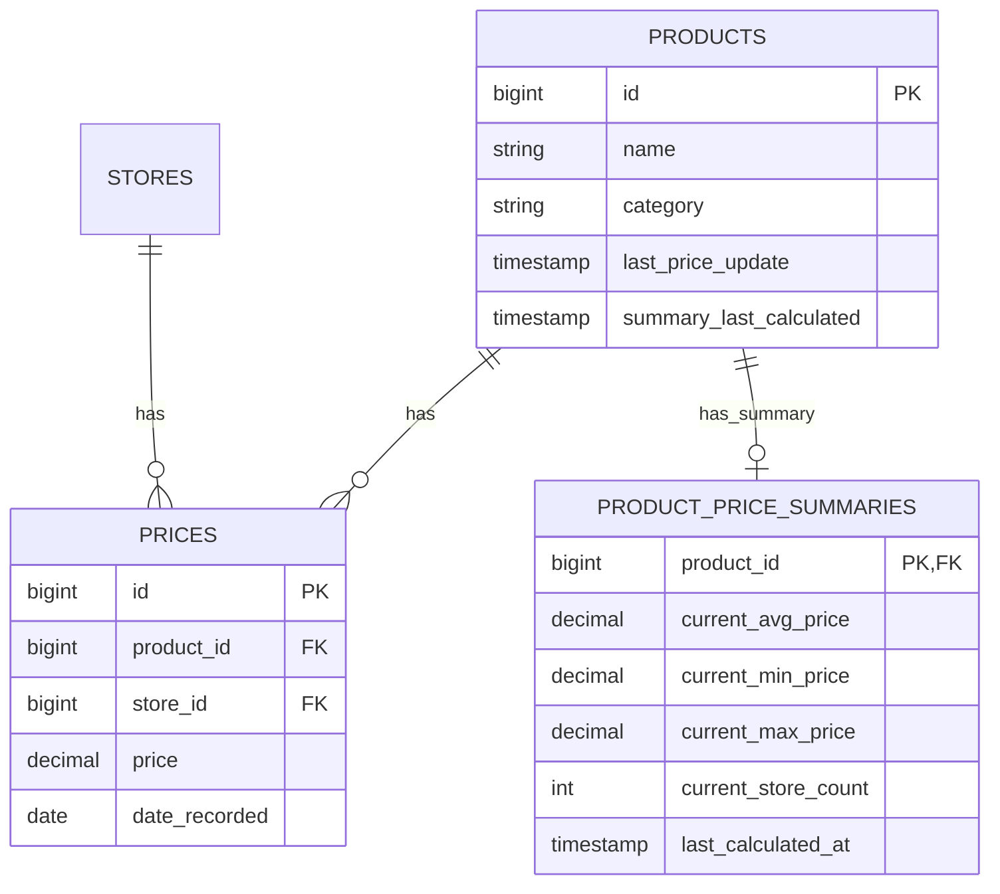

# The Grand Aggregation Strategy 🎯

## Executive Summary

**Problem:** UI needs paginated product lists with price statistics (avg, min, max) without N+1 queries or expensive aggregations.

**Solution:** **Simplified Batch-Only Architecture** - No events, no queues, no complexity. Just a simple batch job that runs every 15-30 minutes and notifies users when updates are ready.

**Core Principle:**
```
┌─────────────────────────────────────────────────────────────────┐
│              SIMPLIFIED BATCH-ONLY ARCHITECTURE                 │
├─────────────────────────────────────────────────────────────────┤
│                                                                 │
│   Price Created                                                 │
│       │                                                         │
│       ├──► Save to prices table                                 │
│       │                                                         │
│       └──► Update product.last_price_update timestamp           │
│                     │                                           │
│                     │ Every 15-30 minutes                       │
│                     ▼                                           │
│              ┌──────────────┐                                   │
│              │ Batch Job    │                                   │
│              │ 1. Find pro- │                                   │
│              │    ducts with│                                   │
│              │    new prices│                                   │
│              │ 2. Calculate │                                   │
│              │    summaries │                                   │
│              │ 3. Notify    │                                   │
│              │    users     │                                   │
│              └──────┬───────┘                                   │
│                     │                                           │
│                     ▼                                           │
│       ┌─────────────────────────┐                               │
│       │ product_price_summaries │                               │
│       │ updated + notifications │                               │
│       │ sent                    │                               │
│       └─────────────────────────┘                               │
│                                                                 │
└─────────────────────────────────────────────────────────────────┘
```

> **Key Design Decision:** **NO events, NO queues, NO complex schedulers.** Just a simple batch job + notifications.

---

## Table of Contents

1. [Architecture Overview](#1-architecture-overview)
2. [Why Simplified Batch-Only?](#2-why-simplified-batch-only)
3. [Data Flow](#3-data-flow)
4. [Implementation Plan](#4-implementation-plan)
5. [Code Examples](#5-code-examples)
6. [ERD Changes](#6-erd-changes)
7. [Migration Strategy](#7-migration-strategy)
8. [Performance Expectations](#8-performance-expectations)

---

## 1. Architecture Overview

### Current State (Problem)

```
Product List API Request
    │
    ▼
SELECT p.*, 
       (SELECT AVG(price) FROM prices WHERE product_id = p.id),
       (SELECT MIN(price) FROM prices WHERE product_id = p.id),
       (SELECT MAX(price) FROM prices WHERE product_id = p.id)
FROM products p
LIMIT 10;

Result: 31 queries for 10 products! ❌
```

### Target State (Solution)

```
Product List API Request
    │
    ▼
SELECT p.id, p.name, ps.avg_price, ps.min_price, ps.max_price
FROM products p
LEFT JOIN product_price_summaries ps ON p.id = ps.product_id
LIMIT 10;

Result: 1 query, < 100ms! ✅
```

---

## 2. Why Simplified Batch-Only?

### Comparison: Architecture Approaches

| Approach | Components | Delay | Complexity | Best For |
|----------|-----------|-------|------------|----------|
| **Complex** (Events+Queue+2 Schedulers) | 6+ classes, Events, Queue | 2 min | High | High volume, real-time needs |
| **Medium** (Events+Immediate) | 4 classes, Events | Seconds | Medium | Low volume, fast updates |
| **✅ Simplified** (Batch Only + Notify) | 3 classes | 15-30 min | **Low** | **Our case!** |

### Why This Fits Perfectly

1. **No Real-Time Requirement** - Users don't need instant price updates
2. **Notification Available** - Users are **notified** when updates are ready
3. **Much Simpler Code** - Single batch job vs. complex event infrastructure
4. **Easier Maintenance** - Fewer moving parts
5. **Better Resource Usage** - No constant event processing
6. **Transparent UX** - Users KNOW when data is fresh

### User Experience

```
User: Uploads receipt
System: Queues for batch processing (no immediate action)
User: Continues browsing other products
System (15-30 min later): 
  ├─ Updates summaries
  └─ Sends notification: "15 products updated!"
User: Clicks notification → sees fresh data

Benefit: User KNOWS when data is ready!
```

---

## 3. Data Flow

### 3.1 Price Creation Flow



### 3.2 Product List Query Flow



### 3.3 State Transitions

```
Price Record State:
┌─────────────┐    Create     ┌─────────────┐    Batch Job    ┌─────────────┐
│   NEW       │──────────────►│   SAVED     │───────────────►│  SUMMARIZED │
└─────────────┘               └─────────────┘   (15-30 min)   └─────────────┘
                                       │
                                       │ Notification
                                       ▼
                              ┌─────────────────┐
                              │  USER NOTIFIED  │
                              └─────────────────┘
```

---

## 4. Implementation Plan

### Phase 1: Database (Day 1)

#### 4.1.1 Create Summary Table

```sql
-- V6__create_product_price_summaries_table.sql
CREATE TABLE product_price_summaries (
    product_id BIGINT PRIMARY KEY,
    
    -- Current window stats (default: last 90 days)
    current_avg_price DECIMAL(10,2),
    current_min_price DECIMAL(10,2),
    current_max_price DECIMAL(10,2),
    current_store_count INT,
    current_price_count INT,
    
    -- All-time stats
    overall_avg_price DECIMAL(10,2),
    overall_min_price DECIMAL(10,2),
    overall_max_price DECIMAL(10,2),
    overall_price_count BIGINT,
    
    -- Time window metadata
    window_start_date DATE,
    window_end_date DATE,
    
    -- Tracking
    last_calculated_at TIMESTAMP NOT NULL,
    last_price_date DATE,
    
    -- Foreign key
    CONSTRAINT fk_product 
        FOREIGN KEY (product_id) 
        REFERENCES products(id)
        ON DELETE CASCADE
);

-- Indexes for fast lookups
CREATE INDEX idx_price_summaries_min_price 
    ON product_price_summaries(current_min_price);
CREATE INDEX idx_price_summaries_calculated_at 
    ON product_price_summaries(last_calculated_at);
```

#### 4.1.2 Add Timestamp to Products

```sql
-- Add tracking columns to products
ALTER TABLE products 
ADD COLUMN last_price_update TIMESTAMP,
ADD COLUMN summary_last_calculated TIMESTAMP;

-- Index for finding products needing updates
CREATE INDEX idx_products_needs_summary_update 
ON products(last_price_update, summary_last_calculated) 
WHERE last_price_update > summary_last_calculated 
   OR summary_last_calculated IS NULL;
```

### Phase 2: Domain Layer (Day 1-2)

#### 4.2.1 Domain Model

```java
// application/domain/model/ProductPriceSummary.java
package com.example.goodsprice.price.application.domain.model;

import java.math.BigDecimal;
import java.time.Instant;
import java.time.LocalDate;
import lombok.Builder;
import lombok.Getter;
import lombok.Setter;

@Builder
@Getter
@Setter
public class ProductPriceSummary {
    private Long productId;
    
    // Current window (e.g., last 90 days)
    private BigDecimal currentAvgPrice;
    private BigDecimal currentMinPrice;
    private BigDecimal currentMaxPrice;
    private Integer currentStoreCount;
    private Integer currentPriceCount;
    
    // All-time
    private BigDecimal overallAvgPrice;
    private BigDecimal overallMinPrice;
    private BigDecimal overallMaxPrice;
    private Long overallPriceCount;
    
    // Metadata
    private LocalDate windowStartDate;
    private LocalDate windowEndDate;
    private Instant lastCalculatedAt;
    private LocalDate lastPriceDate;
}
```

#### 4.2.2 Ports

```java
// application/port/out/PriceSummaryRepositoryPort.java
package com.example.goodsprice.price.application.port.out;

import com.example.goodsprice.price.application.domain.model.ProductPriceSummary;
import java.util.List;
import java.util.Set;

public interface PriceSummaryRepositoryPort {
    
    ProductPriceSummary save(ProductPriceSummary summary);
    
    void saveAll(List<ProductPriceSummary> summaries);
    
    ProductPriceSummary findByProductId(Long productId);
    
    List<ProductPriceSummary> findByProductIds(Set<Long> productIds);
}
```

### Phase 3: Application Service (Day 2)

#### 4.3.1 Price Service - Track Updates

```java
// application/domain/service/PriceService.java
package com.example.goodsprice.price.application.domain.service;

import com.example.goodsprice.price.application.port.out.PriceRepositoryPort;
import com.example.goodsprice.product.application.port.out.ProductRepositoryPort;
import java.time.Instant;
import lombok.RequiredArgsConstructor;
import lombok.extern.slf4j.Slf4j;
import org.springframework.stereotype.Service;
import org.springframework.transaction.annotation.Transactional;

@Slf4j
@Service
@RequiredArgsConstructor
public class PriceService {
    
    private final PriceRepositoryPort priceRepository;
    private final ProductRepositoryPort productRepository;
    
    /**
     * Create a new price entry.
     * Just updates timestamp - batch job will handle summary later!
     */
    @Transactional
    public Price createPrice(CreatePriceRequest request) {
        log.debug("Creating price for product: {} store: {}", 
            request.getProductId(), request.getStoreId());
        
        // 1. Save the price
        Price price = Price.builder()
            .productId(request.getProductId())
            .storeId(request.getStoreId())
            .price(request.getPrice())
            .dateRecorded(request.getDateRecorded())
            .build();
        
        Price saved = priceRepository.save(price);
        
        // 2. Mark product as having new prices
        // This is just a timestamp update - no events, no complexity!
        Product product = productRepository.findById(price.getProductId());
        if (product != null) {
            product.setLastPriceUpdate(Instant.now());
            productRepository.save(product);
            log.debug("Marked product {} as having new prices", 
                product.getId());
        }
        
        // 3. Done! Batch job will pick this up later
        log.info("Price created: {}. Will be summarized in next batch run.", 
            saved.getId());
        
        return saved;
    }
}
```

#### 4.3.2 Batch Summary Service

```java
// application/domain/service/PriceSummaryBatchService.java
package com.example.goodsprice.price.application.domain.service;

import com.example.goodsprice.price.application.domain.model.Price;
import com.example.goodsprice.price.application.domain.model.ProductPriceSummary;
import com.example.goodsprice.price.application.port.out.PriceRepositoryPort;
import com.example.goodsprice.price.application.port.out.PriceSummaryRepositoryPort;
import com.example.goodsprice.product.application.domain.model.Product;
import com.example.goodsprice.product.application.port.out.ProductRepositoryPort;
import java.math.BigDecimal;
import java.math.RoundingMode;
import java.time.Instant;
import java.time.LocalDate;
import java.time.temporal.ChronoUnit;
import java.util.ArrayList;
import java.util.DoubleSummaryStatistics;
import java.util.List;
import lombok.RequiredArgsConstructor;
import lombok.extern.slf4j.Slf4j;
import org.springframework.stereotype.Service;
import org.springframework.transaction.annotation.Transactional;

@Slf4j
@Service
@RequiredArgsConstructor
public class PriceSummaryBatchService {
    
    private final ProductRepositoryPort productRepository;
    private final PriceRepositoryPort priceRepository;
    private final PriceSummaryRepositoryPort summaryRepository;
    private final NotificationService notificationService;
    
    private static final int DEFAULT_WINDOW_DAYS = 90;
    private static final int BATCH_SIZE = 100; // Process 100 at a time
    
    /**
     * Main batch job entry point.
     * Finds all products with new prices and updates their summaries.
     */
    @Transactional
    public BatchResult updateSummaries() {
        log.info("Starting summary update batch job");
        
        // 1. Find products needing update
        List<Product> productsNeedingUpdate = productRepository
            .findProductsNeedingSummaryUpdate();
        
        if (productsNeedingUpdate.isEmpty()) {
            log.info("No products need summary updates");
            return BatchResult.empty();
        }
        
        log.info("Found {} products with new prices", 
            productsNeedingUpdate.size());
        
        // 2. Process in batches to avoid memory issues
        List<Long> updatedProductIds = new ArrayList<>();
        int successCount = 0;
        int failureCount = 0;
        
        for (int i = 0; i < productsNeedingUpdate.size(); i += BATCH_SIZE) {
            List<Product> batch = productsNeedingUpdate.subList(
                i, Math.min(i + BATCH_SIZE, productsNeedingUpdate.size()));
            
            for (Product product : batch) {
                try {
                    updateProductSummary(product);
                    updatedProductIds.add(product.getId());
                    successCount++;
                } catch (Exception e) {
                    log.error("Failed to update summary for product: {}", 
                        product.getId(), e);
                    failureCount++;
                    // Continue with next product
                }
            }
            
            log.debug("Processed batch {}/{} ({} products)", 
                (i / BATCH_SIZE) + 1, 
                (productsNeedingUpdate.size() + BATCH_SIZE - 1) / BATCH_SIZE,
                batch.size());
        }
        
        // 3. Send notifications
        if (!updatedProductIds.isEmpty()) {
            notificationService.notifyPriceUpdatesAvailable(updatedProductIds);
            log.info("Sent notifications for {} updated products", 
                updatedProductIds.size());
        }
        
        log.info("Batch job completed. Success: {}, Failed: {}", 
            successCount, failureCount);
        
        return BatchResult.builder()
            .processed(successCount)
            .failed(failureCount)
            .updatedProductIds(updatedProductIds)
            .build();
    }
    
    private void updateProductSummary(Product product) {
        Long productId = product.getId();
        
        // Fetch all prices for this product
        List<Price> allPrices = priceRepository.findByProductId(productId);
        
        if (allPrices.isEmpty()) {
            // No prices - create empty summary
            ProductPriceSummary emptySummary = ProductPriceSummary.builder()
                .productId(productId)
                .lastCalculatedAt(Instant.now())
                .build();
            summaryRepository.save(emptySummary);
        } else {
            // Calculate and save summary
            ProductPriceSummary summary = calculateSummary(productId, allPrices);
            summaryRepository.save(summary);
        }
        
        // Update product's "last calculated" timestamp
        product.setSummaryLastCalculated(Instant.now());
        productRepository.save(product);
        
        log.debug("Updated summary for product: {}", productId);
    }
    
    private ProductPriceSummary calculateSummary(Long productId, List<Price> prices) {
        LocalDate now = LocalDate.now();
        LocalDate windowStart = now.minus(DEFAULT_WINDOW_DAYS, ChronoUnit.DAYS);
        
        // Split into window and all-time
        List<Price> windowPrices = prices.stream()
            .filter(p -> !p.getDateRecorded().isBefore(windowStart))
            .toList();
        
        // Calculate window stats
        PriceStats windowStats = calculateStats(windowPrices);
        PriceStats allTimeStats = calculateStats(prices);
        
        // Count unique stores
        long windowStoreCount = windowPrices.stream()
            .map(Price::getStoreId)
            .distinct()
            .count();
        
        // Latest price date
        LocalDate lastPriceDate = prices.stream()
            .map(Price::getDateRecorded)
            .max(LocalDate::compareTo)
            .orElse(null);
        
        return ProductPriceSummary.builder()
            .productId(productId)
            // Current window
            .currentAvgPrice(windowStats.avg)
            .currentMinPrice(windowStats.min)
            .currentMaxPrice(windowStats.max)
            .currentStoreCount((int) windowStoreCount)
            .currentPriceCount(windowPrices.size())
            // All-time
            .overallAvgPrice(allTimeStats.avg)
            .overallMinPrice(allTimeStats.min)
            .overallMaxPrice(allTimeStats.max)
            .overallPriceCount((long) prices.size())
            // Metadata
            .windowStartDate(windowStart)
            .windowEndDate(now)
            .lastCalculatedAt(Instant.now())
            .lastPriceDate(lastPriceDate)
            .build();
    }
    
    private PriceStats calculateStats(List<Price> prices) {
        if (prices.isEmpty()) {
            return new PriceStats(null, null, null);
        }
        
        DoubleSummaryStatistics stats = prices.stream()
            .mapToDouble(Price::getPrice)
            .summaryStatistics();
        
        return new PriceStats(
            BigDecimal.valueOf(stats.getAverage())
                .setScale(2, RoundingMode.HALF_UP),
            BigDecimal.valueOf(stats.getMin()),
            BigDecimal.valueOf(stats.getMax())
        );
    }
    
    private record PriceStats(BigDecimal avg, BigDecimal min, BigDecimal max) {}
    
    @lombok.Builder
    @lombok.Getter
    public record BatchResult(
        int processed,
        int failed,
        List<Long> updatedProductIds
    ) {
        public static BatchResult empty() {
            return new BatchResult(0, 0, List.of());
        }
    }
}
```

#### 4.3.3 Notification Service

```java
// application/domain/service/NotificationService.java
package com.example.goodsprice.price.application.domain.service;

import com.example.goodsprice.common.event.NotificationEvent;
import com.example.goodsprice.price.application.port.out.NotificationPort;
import java.time.Instant;
import java.util.List;
import lombok.RequiredArgsConstructor;
import lombok.extern.slf4j.Slf4j;
import org.springframework.stereotype.Service;

@Slf4j
@Service
@RequiredArgsConstructor
public class NotificationService {
    
    private final NotificationPort notificationPort;
    
    /**
     * Notify users that price updates are available.
     * Called after batch job completes.
     */
    public void notifyPriceUpdatesAvailable(List<Long> productIds) {
        if (productIds.isEmpty()) {
            return;
        }
        
        log.info("Sending price update notification for {} products", 
            productIds.size());
        
        NotificationEvent event = NotificationEvent.builder()
            .type("PRICE_UPDATES_AVAILABLE")
            .title("New Price Data Available")
            .message(productIds.size() + " products have updated prices")
            .productIds(productIds)
            .timestamp(Instant.now())
            .build();
        
        notificationPort.send(event);
        
        log.debug("Notification sent successfully");
    }
}
```

### Phase 4: Infrastructure (Day 2-3)

#### 4.4.1 Entity & Repository

```java
// infrastructure/adapter/persistence/entity/PriceSummaryEntity.java
package com.example.goodsprice.price.infrastructure.adapter.persistence.entity;

import jakarta.persistence.Column;
import jakarta.persistence.Entity;
import jakarta.persistence.Id;
import jakarta.persistence.Table;
import java.math.BigDecimal;
import java.time.Instant;
import java.time.LocalDate;
import lombok.AllArgsConstructor;
import lombok.Data;
import lombok.NoArgsConstructor;
import org.hibernate.annotations.CreationTimestamp;
import org.hibernate.annotations.UpdateTimestamp;

@Entity
@Table(name = "product_price_summaries")
@Data
@NoArgsConstructor
@AllArgsConstructor
public class PriceSummaryEntity {
    
    @Id
    @Column(name = "product_id")
    private Long productId;
    
    // Current window
    @Column(name = "current_avg_price", precision = 10, scale = 2)
    private BigDecimal currentAvgPrice;
    
    @Column(name = "current_min_price", precision = 10, scale = 2)
    private BigDecimal currentMinPrice;
    
    @Column(name = "current_max_price", precision = 10, scale = 2)
    private BigDecimal currentMaxPrice;
    
    @Column(name = "current_store_count")
    private Integer currentStoreCount;
    
    @Column(name = "current_price_count")
    private Integer currentPriceCount;
    
    // All-time
    @Column(name = "overall_avg_price", precision = 10, scale = 2)
    private BigDecimal overallAvgPrice;
    
    @Column(name = "overall_min_price", precision = 10, scale = 2)
    private BigDecimal overallMinPrice;
    
    @Column(name = "overall_max_price", precision = 10, scale = 2)
    private BigDecimal overallMaxPrice;
    
    @Column(name = "overall_price_count")
    private Long overallPriceCount;
    
    // Window metadata
    @Column(name = "window_start_date")
    private LocalDate windowStartDate;
    
    @Column(name = "window_end_date")
    private LocalDate windowEndDate;
    
    @Column(name = "last_calculated_at")
    private Instant lastCalculatedAt;
    
    @Column(name = "last_price_date")
    private LocalDate lastPriceDate;
    
    @CreationTimestamp
    @Column(name = "created_at", updatable = false)
    private Instant createdAt;
    
    @UpdateTimestamp
    @Column(name = "updated_at")
    private Instant updatedAt;
}

// infrastructure/adapter/persistence/JpaPriceSummaryRepository.java
package com.example.goodsprice.price.infrastructure.adapter.persistence;

import com.example.goodsprice.price.infrastructure.adapter.persistence.entity.PriceSummaryEntity;
import java.util.List;
import java.util.Set;
import org.springframework.data.jpa.repository.JpaRepository;
import org.springframework.stereotype.Repository;

@Repository
public interface JpaPriceSummaryRepository extends JpaRepository<PriceSummaryEntity, Long> {
    
    List<PriceSummaryEntity> findByProductIdIn(Set<Long> productIds);
}
```

#### 4.4.2 Product Repository Extension

```java
// Add to product infrastructure
package com.example.goodsprice.product.infrastructure.adapter.persistence;

import com.example.goodsprice.product.infrastructure.adapter.persistence.entity.ProductEntity;
import java.util.List;
import org.springframework.data.jpa.repository.JpaRepository;
import org.springframework.data.jpa.repository.Query;
import org.springframework.stereotype.Repository;

@Repository
public interface JpaProductRepository extends JpaRepository<ProductEntity, Long> {
    
    /**
     * Find products where:
     * - last_price_update > summary_last_calculated (has new prices)
     * - OR summary_last_calculated IS NULL (never calculated)
     */
    @Query("SELECT p FROM ProductEntity p " +
           "WHERE p.lastPriceUpdate > p.summaryLastCalculated " +
           "   OR p.summaryLastCalculated IS NULL")
    List<ProductEntity> findProductsNeedingSummaryUpdate();
}
```

#### 4.4.3 Batch Job Scheduler

```java
// infrastructure/scheduler/PriceSummaryBatchScheduler.java
package com.example.goodsprice.price.infrastructure.scheduler;

import com.example.goodsprice.price.application.domain.service.PriceSummaryBatchService;
import lombok.RequiredArgsConstructor;
import lombok.extern.slf4j.Slf4j;
import org.springframework.scheduling.annotation.Scheduled;
import org.springframework.stereotype.Component;

@Slf4j
@Component
@RequiredArgsConstructor
public class PriceSummaryBatchScheduler {
    
    private final PriceSummaryBatchService batchService;
    
    /**
     * Run batch job every 15 minutes.
     * 
     * Adjust frequency based on:
     * - Price update volume
     * - User expectations
     * - System capacity
     * 
     * Options: 5 min (frequent), 15 min (balanced), 30 min (relaxed)
     */
    @Scheduled(fixedDelay = 15, timeUnit = java.util.concurrent.TimeUnit.MINUTES)
    public void runBatchJob() {
        log.info("Starting scheduled price summary batch job");
        
        try {
            BatchResult result = batchService.updateSummaries();
            
            log.info("Batch job completed. Processed: {}, Failed: {}", 
                result.processed(), result.failed());
        } catch (Exception e) {
            log.error("Batch job failed", e);
            // Job will retry on next scheduled run
        }
    }
}
```

---

## 5. Code Examples

### 5.1 Configuration

```yaml
# application.yml
price:
  summary:
    batch:
      enabled: true
      interval: 15m  # 5m, 15m, or 30m
      batch-size: 100  # Process 100 products at a time
    notification:
      enabled: true
      strategy: BULK  # BULK or INDIVIDUAL
```

### 5.2 API Response DTO

```java
// ProductWithPriceStatsDto.java
public record ProductWithPriceStatsDto(
    Long id,
    String name,
    String category,
    PriceStatsDto stats,
    Instant lastPriceUpdate,
    Instant summaryLastCalculated,
    boolean hasNewPrices
) {
    public record PriceStatsDto(
        BigDecimal avgPrice,
        BigDecimal minPrice,
        BigDecimal maxPrice,
        Integer storeCount,
        Integer priceCount
    ) {}
}
```

### 5.3 Controller Example

```java
@RestController
@RequestMapping("/api/products")
@RequiredArgsConstructor
public class ProductController {
    
    private final ProductService productService;
    
    @GetMapping
    public Page<ProductWithPriceStatsDto> getProducts(
            @RequestParam(defaultValue = "0") int page,
            @RequestParam(defaultValue = "10") int size) {
        
        return productService.getProductsWithStats(PageRequest.of(page, size));
    }
    
    @GetMapping("/updates-available")
    public ResponseEntity<UpdatesAvailableResponse> checkUpdates() {
        // Check if user has unseen price updates
        boolean hasUpdates = notificationService.hasUnreadUpdates();
        return ResponseEntity.ok(new UpdatesAvailableResponse(hasUpdates));
    }
}
```

---

## 6. ERD Changes

### Before


### After


---

## 7. Migration Strategy

### 7.1 Database Migration

```sql
-- V6__create_product_price_summaries_table.sql
-- (As shown above)

-- V7__add_product_tracking_columns.sql
ALTER TABLE products 
ADD COLUMN last_price_update TIMESTAMP,
ADD COLUMN summary_last_calculated TIMESTAMP;

-- V8__backfill_product_summaries.sql
-- Initial population via batch job (no manual SQL needed)
```

### 7.2 Backfill Strategy

```java
@Component
public class BackfillJob {
    
    @EventListener(ApplicationReadyEvent.class)
    @ConditionalOnProperty(name = "jobs.backfill.enabled")
    public void runBackfill() {
        // Find all products that need initial summary
        List<Product> products = productRepository.findAll();
        
        // Mark all as needing update
        for (Product p : products) {
            p.setLastPriceUpdate(Instant.now());
            productRepository.save(p);
        }
        
        // Next batch job run will calculate all summaries
        log.info("Marked {} products for initial summary calculation", 
            products.size());
    }
}
```

### 7.3 Zero-Downtime Deployment

1. **Deploy code** (feature flag OFF)
2. **Run migrations** (create tables, add columns)
3. **Enable backfill job** (mark all products)
4. **Wait for first batch run** (15-30 min)
5. **Enable feature** (use summary table)
6. **Monitor** (verify data consistency)

---

## 8. Performance Expectations

### Before (Current)

| Metric | Value |
|--------|-------|
| Product list (10 items) | 500-2000ms |
| DB queries | 31 queries |
| CPU usage | High (aggregation) |
| Scalability | Poor |

### After (With Summary Table)

| Metric | Value |
|--------|-------|
| Product list (10 items) | 50-100ms |
| DB queries | 1-2 queries |
| CPU usage | Low (pre-computed) |
| Scalability | Excellent |

### Batch Job Performance

| Products | Processing Time | Queries |
|----------|----------------|---------|
| 100 | ~2-3 seconds | 101 (1 find + 100 calculate) |
| 1,000 | ~20-30 seconds | 1,001 |
| 10,000 | ~3-5 minutes | 10,001 |

**Adjust batch frequency based on volume!**

---

## Trade-offs

| Aspect | Impact |
|--------|--------|
| Data freshness | 15-30 minute delay (acceptable with notifications) |
| Storage | +20-30% (summary table) |
| Complexity | Low (single batch job) |
| Maintenance | Easy (few moving parts) |

---

## Next Steps

1. ✅ **Review this document** - Confirm approach
2. **Create sub-tasks** - Break into implementation tickets
3. **Estimate effort** - ~9 days total
4. **Start Phase 1** - Database migration
5. **Test batch job** - Verify with sample data

---

**Questions to resolve:**
- [ ] Acceptable batch frequency? (current: 15 minutes)
- [ ] Notification strategy? (bulk vs. individual)
- [ ] Time window for stats? (current: 90 days)

**Document Status:** ✅ Ready for Implementation
